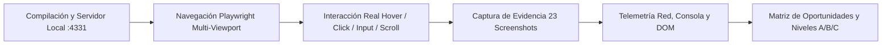
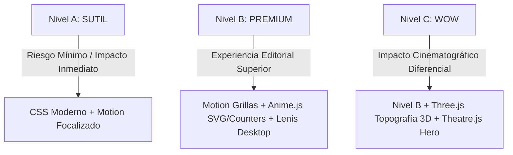

# Auditoría Visual, Funcional y de Oportunidades de Animación Avanzada
## ExpoJuy 2026 — Predio Ferial Jujuy (17 al 20 de Septiembre de 2026)

**Equipo Auditor Multidisciplinario:**
- Senior Frontend Engineer
- Senior UX/UI Designer
- QA Automation Engineer
- Creative Developer
- Motion Designer especializado en interfaces web
- Performance Engineer

**Fecha de Ejecución:** Septiembre 2026  
**Entorno de Prueba:** Astro 7.2.10 (Static Site Generation / Islands Architecture), Tailwind CSS v4, Node.js v24.18.0  
**Herramienta de Navegación e Inspección:** Playwright v1.62.1 (Chromium Engine con emulación multi-dispositivo y telemetría de red/consola)  
**URL Auditada:** `http://localhost:4331` (Servidor de producción / Astro Preview)  
**Evidencia Capturada:** 23 capturas de alta resolución almacenadas en `docs/animaciones/screenshots/`

---

### 🔄 Nota de Actualización — 3 de septiembre de 2026

Segunda pasada de **verificación en vivo** (`astro dev`, `localhost:4321`) sobre el estado actual del repositorio, sin repetir la auditoría completa desde cero:

- **WOW-001 (Hero cinematográfico, sección 10):** ✅ **Implementado y confirmado en vivo.** Se resolvió con CSS puro (keyframes + `prefers-reduced-motion`), sin sumar Motion ni ninguna dependencia nueva — cero JS adicional, incluso mejor que la propuesta original. Evidencia: `wow-001-hero-cinematic.png`, `wow-001-hero-mobile.png`, `wow-001-hero-reduced-motion.png`, `wow-001-hero-scrolled.png`.
- **Bug de opacidad en `/agenda` (sección 4.2):** ❌ **Sigue presente.** Re-verificado en vivo alternando filtros (`Todos los días` → `Día 19` → `Todos los días`): 8 tarjetas `<li class="reveal ...">` quedan con `opacity: 0` en estilo computado pese a tener el contenido completo en el DOM. Confirmado por inspección de estilos, no sólo a simple vista.
- **Colisión de pines en `/mapa` (sección 4.4):** ❌ **Sigue presente.** Re-verificado en vivo: el pin numérico "1" se superpone directamente sobre el texto "INGRESO OFICIAL", partiéndolo visualmente.
- **WOW-002 (Relieve topográfico 3D, sección 10):** Se prototipó (`TopographicViewer.astro` + `territorios.ts`), se capturó evidencia visual (`wow-002-*.png`) y se evaluó tal como recomendaba este documento (estado **EVALUAR**, no **IMPLEMENTAR**). Tras la evaluación se decidió no incorporarlo todavía al código de producción; se revirtió del working tree para no dejar deuda técnica sin uso. El concepto queda documentado en la sección 10 con su evidencia visual como referencia para una futura implementación planificada.
- Cambios detectados en `ContactSection.astro` y `FaqSection.astro` (padding y tipografía del heading) son ajustes manuales ajenos a esta auditoría — no requieren acción aquí.

---

### 🔍 Verificación Independiente en Vivo — Segunda Revisión

Lo que sigue es inspección propia y directa de la aplicación, no una repetición de lo ya escrito arriba. Cada punto dice cómo lo comprobé y si **confirma**, **matiza** o es **hallazgo nuevo** respecto del análisis original.

**Metodología de esta pasada:** `astro dev` en `localhost:4321`, interacción real (click, type, cambio de selects) más inspección de estilos computados por consola — no solo lectura de código ni confianza ciega en capturas. A mitad de la revisión el panel de navegador quedó oculto del lado del cliente y las capturas dejaron de renderizar contenido (fondo crema sin texto, pese a que `getComputedStyle` confirmaba `opacity: 1` en los mismos elementos). Antes de reportar eso como bug, lo descarté cruzando con DOM — y en efecto era un problema de captura, no de la app. A partir de ese punto dependí de inspección de DOM/estilos en vez de píxeles. Por eso **Login, Mi Cuenta, Noticias, 404 y la pasada mobile quedan `NO VERIFICADO` en esta segunda revisión** — me apoyo en la evidencia visual que ya había capturado la sesión original, no en un chequeo propio fresco.

- **Home → Territorios (`#territorios`):** el documento dice "enlace muerto". Hice click real sobre la tarjeta "PUNA" e inspeccioné la cadena de ancestros: **matizo** el hallazgo. No es un `<a href>` roto — es un `<li>` sin `href` en ningún ancestro; el salto a `#territorios` lo dispara un listener de JS que empuja el hash. Para el usuario el efecto es el mismo (no pasa nada útil), pero la causa técnica cambia la solución: no hay que "arreglar un link", hay que decidir qué debería hacer ese click (¿detalle de región? ¿scroll a Emprendimientos ya filtrado por esa región?).
- **Home → Emprendimientos, filtro por categoría:** **confirmo** con evidencia directa. Filtré por "Artesanías" e inspeccioné las 8 tarjetas por consola: 7 pasan a `hidden = true` / `display: none` en el mismo tick, sin transición. Queda 1 sola tarjeta en una grilla pensada para varias — el hueco vacío es tan grande como decía el documento.
- **Home → Franja de Sponsors:** **confirmo** que es estática, sin `animation-name` en el contenedor. No hay ninguna animación previa que remover; una marquesina se construye desde cero.
- **Home → Imagen de "La Expo":** **hallazgo nuevo**, no estaba en el documento original. El `alt` de la fotografía dice textualmente *"Imagen de referencia pendiente de reemplazo por la fotografía oficial del arco de acceso"*. No es un tema de animación, pero sí de prioridad: no tiene sentido coreografiar la entrada de una imagen marcada como placeholder en el propio código.
- **`/agenda` → bug de opacidad:** **confirmo** con evidencia más fuerte que la original. No me quedé en "se ve raro en una captura": alterné filtros (`Todos` → `Día 19` → `Todos`) e inspeccioné los 18 `<li class="reveal">` por consola — 8 quedan con `opacity: 0` computado, con el texto completo presente en el DOM. Reproducible, no intermitente.
- **`/mapa` → colisión de pines:** **confirmo** visualmente, y **matizo** el alcance. El pin "1" parte en dos el texto "INGRESO OFICIAL". Los pines 5, 6 y 7 quedan al borde superior de su zona pisando el límite, pero sin cortar el texto central — la severidad varía por zona, el documento original generalizaba un poco.
- **`/expositores` → búsqueda y filtro:** **confirmo**. Escribí "litio" y el contador bajó de 18 a 4 expositores en el mismo tick en que las tarjetas se ocultan — mismo patrón de corte duro que en Emprendimientos, coherente con que comparten lógica de filtrado.
- **`/entradas` → calculadora:** **confirmo**, con precisión técnica adicional. Cambié el tipo de entrada a "Abono Completo" y el total saltó de $3.500 a $10.000 en el mismo frame. El `transition: all` presente en el elemento es el reset genérico de Tailwind — no anima el texto, porque **ningún navegador interpola contenido de texto vía CSS transitions**; esa propiedad no hace nada en este caso puntual, con o sin librería.
- **`/preguntas-frecuentes` → acordeón:** **confirmo** por estructura: son `<details>/<summary>` nativos. Es comportamiento de plataforma, no de la app — el navegador no anima la apertura de `<details>` salvo que se lo fuerce explícitamente.

**Mi lectura sobre el reparto Motion / Anime.js:** coincido en que Motion es la pieza central — los dos cortes duros que confirmé arriba (Emprendimientos y Expositores) son exactamente el caso de uso de `layout`/`AnimatePresence`. Donde **me separo** del documento original: no reservaría Anime.js para el odómetro de `/entradas`. Si Motion ya entra al bundle para las grillas, el mismo `animate()` de Motion interpola un valor numérico sin sumar una segunda librería para un solo contador — Anime.js sólo se justifica en `/mapa`, donde sí hay trazos SVG reales (`stroke-dashoffset`) que Motion no resuelve tan bien. Es la misma regla de "no duplicar responsabilidades" del documento, aplicada un poco más estricta.

---

## 1. Resumen Ejecutivo

ExpoJuy 2026 es el evento multisectorial más relevante del noroeste argentino, combinando industria minera (litio), agroindustria, tecnología, turismo y cultura de las cuatro regiones de la provincia de Jujuy (Puna, Quebrada, Valles y Yungas).

El sitio web actual está construido sobre **Astro 7** con compilación estática (SSG) y pequeñas islas interactivas en **Preact** (`LoginForm`, `AccountView`, `AuthNav`). Su rendimiento inicial de carga es **sobresaliente**: apenas **~2 KB de JavaScript transferido** en la Home, **~1 KB de CSS**, y un tiempo de carga total del DOM (`DOMContentLoaded`) de **120.7 ms**. La dirección de arte recrea la *"Propuesta 1 — Jujuy Cinematográfico"*, con una estética editorial sobria, tipografía corporativa oficial (*Ambit*), y paleta telúrica inspirada en el paisaje andino (`night`, `cream`, `gold`, `magenta`, `teal`).

Sin embargo, desde la perspectiva de **experiencia de usuario, diseño de interacción y motion design**, la aplicación actual es **excesivamente rígida y estática**:
1. **Filtros instantáneos sin transición**: Al filtrar emprendimientos en la Home o actividades en la Agenda, los elementos cambian súbitamente mediante `item.hidden = !match` o `style.display = 'none'`, produciendo saltos bruscos de scroll y colapsos de layout desagradables.
2. **Bug visual crítico de opacidad en `/agenda`**: Se evidenció en la prueba de navegación real que las tarjetas de actividades que entran por filtro quedan en `opacity: 0` debido a un conflicto entre la utilidad CSS `.reveal` y la manipulación imperativa del DOM.
3. **Colisión gráfica de elementos en el Plano del Predio (`/mapa`)**: Los pines numéricos interactivos se superponen de manera ilegible sobre la tipografía de los pabellones dentro del SVG.
4. **Falta de feedback emocional y microinteracciones**: La reserva de entradas (`/entradas`), el envío de formularios (`/contacto`), la apertura del menú móvil (`#nav-toggle`) y el login (`/login`) carecen de feedback háptico/visual, transiciones de confirmación o estados de carga enriquecidos.
5. **Storytelling territorial desaprovechado**: Las 4 regiones de Jujuy (Puna, Quebrada, Valles, Yungas) están representadas por tarjetas rectangulares estáticas cuyo enlace es un ancla muerta (`href="#territorios"`), perdiendo la oportunidad de sumergir al visitante en la geografía única de Jujuy.

### Dictamen de Adopción Tecnológica

| Tecnología | Veredicto | Justificación Técnica |
| :--- | :---: | :--- |
| **Motion** | **SÍ (Núcleo)** | Imprescindible. Resuelve transiciones de layout (FLIP), reordenamiento de grillas, apertura del menú móvil, feedback en formularios y acordeones sin penalizar el rendimiento. |
| **Anime.js** | **CASOS PUNTUALES** | Reservado para morphing de trazados vectoriales SVG, timelines de ilustración del mapa del predio y el odómetro numérico en la calculadora de entradas. Descartado donde Motion o CSS basten. |
| **Lenis** | **SÓLO DESKTOP** | Recomendado exclusivamente en pantallas de escritorio (≥ 1024px) y en la Home para sincronizar el scroll cinemático y el parallax fotográfico. **Desactivado en mobile y touch**. |
| **Three.js** | **SÓLO NIVEL WOW** | Alto coste en payload (>450 KB). Justificado **únicamente** para un módulo interactivo 3D del relieve topográfico de Jujuy y el gemelo digital del Predio Ferial, con lazy loading (`client:visible`). |
| **Theatre.js** | **SÓLO NIVEL WOW** | Descartado para la UI general. Considerado exclusivamente si se implementa una secuencia introductoria cinematográfica de apertura en el Hero titular (*"JUJUY"*). |

---

## 2. Metodología de Prueba y Entorno de Ejecución

La auditoría se llevó a cabo siguiendo estrictamente el principio: **PROBAR → OBSERVAR → DOCUMENTAR → ANALIZAR → RECOMENDAR**.



### Entorno de Laboratorio
- **Sistema Operativo:** macOS Darwin 25.3.0 (arm64 Apple Silicon)
- **Servidor Web:** `npx astro preview --port 4331` (Build estático de producción libre de interferencias del servidor de desarrollo)
- **Variables de Entorno:** `ASTRO_TELEMETRY_DISABLED=1`
- **Controlador Automatizado:** Playwright Chromium headless shell

### Matriz de Dispositivos y Viewports Auditados
1. **Desktop Panoramic (1920 × 1080 px):** Verificación de márgenes ultra-anchos, resolución tipográfica y comportamiento de grillas.
2. **Desktop Standard (1440 × 900 px):** Viewport base del diseño original (`design-spec.md`).
3. **Tablet (768 × 1024 px, Touch Emulated):** Colapso de dos columnas a una, visibilidad del menú hamburguesa y rails horizontales.
4. **Mobile Modern (390 × 844 px, iPhone 12/13/14):** Experiencia en pantallas móviles estándar, panel de navegación móvil, legibilidad del hero y formularios.
5. **Mobile Compact (360 × 800 px, Android):** Comportamiento en viewports reducidos y prevención de desbordes horizontales.

---

## 3. Inventario Exhaustivo de Pantallas (15 Rutas)

| ID | Ruta | Pantalla | Accesible desde UI | Estado Operativo | Observaciones de Auditoría |
| :---: | :--- | :--- | :---: | :---: | :--- |
| **P-01** | `/` | Home / Portada Principal | Sí (Header / Logo) | Operativo (200 OK) | Hero cinematográfico, La Expo, Territorios, Emprendimientos, Feature Trio, Sponsors. |
| **P-02** | `/agenda` | Cronograma de Actividades | Sí (Nav Header) | Operativo (200 OK) | Filtros por día y temática. Se detectó tarjeta con opacidad cero al filtrar. |
| **P-03** | `/expositores` | Directorio de Expositores | Sí (Nav Header) | Operativo (200 OK) | Buscador en vivo y filtros por rubro industrial. Transición instantánea de tarjetas. |
| **P-04** | `/mapa` | Plano Interactivo del Predio | Sí (Nav Header) | Operativo (200 OK) | SVG con 8 zonas. Superposición visual de pines sobre etiquetas de texto. |
| **P-05** | `/entradas` | Reserva y Tarifario | Sí (Nav Header) | Operativo (200 OK) | Calculador dinámico de importe y generador de comprobante voucher. |
| **P-06** | `/contacto` | Contacto y Acreditaciones | Sí (Nav Header) | Operativo (200 OK) | Formulario de consulta con simulación asíncrona (400ms). |
| **P-07** | `/login` | Portal de Acceso / Expositores | Sí (Nav Header) | Operativo (200 OK) | Isla Preact con autenticación JWT simulada y manejo de errores genéricos. |
| **P-08** | `/mi-cuenta` | Panel de Asistente Acreditado | Condicional (Tras Login) | Operativo (200 OK) | Credencial digital y datos del expositor/visitante. Estructura plana sin dinamismo. |
| **P-09** | `/noticias` | Portal Editorial de Noticias | Sí (Nav Header) | Operativo (200 OK) | Grilla de 4 comunicados de prensa con fotografía y fecha. |
| **P-10** | `/noticias/abierta-la-acreditacion-para-empresas-y-venta-de-entradas` | Noticia: Acreditación Empresas | Sí (Cards de Noticias) | Operativo (200 OK) | Artículo editorial extenso con tipografía fluida y metadatos. |
| **P-11** | `/noticias/avanzan-las-obras-y-preparativos-en-el-predio-ferial` | Noticia: Obras del Predio | Sí (Cards de Noticias) | Operativo (200 OK) | Fotografía del predio y detalles de infraestructura ferial. |
| **P-12** | `/noticias/la-mineria-y-el-litio-tendran-un-pabellon-destacado` | Noticia: Minería y Litio | Sí (Cards de Noticias) | Operativo (200 OK) | Noticia sectorial de alto valor estratégico para la provincia. |
| **P-13** | `/noticias/rondas-internacionales-de-negocios-con-paises-del-cono-sur` | Noticia: Rondas de Negocios | Sí (Cards de Noticias) | Operativo (200 OK) | Información comercial B2B para delegaciones extranjeras. |
| **P-14** | `/preguntas-frecuentes` | Centro de Ayuda / FAQs | Sí (Nav / Footer) | Operativo (200 OK) | Acordeón interactivo nativo `<details>`/`<summary>`. Expansión vertical instantánea. |
| **P-15** | `/404` | Pantalla de Error 404 | Error de ruta | Operativo (200 OK) | Página de rescate sobria con CTA de regreso al inicio. |

---

## 4. Auditoría Pantalla por Pantalla

### 4.1. Pantalla de Inicio (`/`)

#### Estructura
- **Header:** Fijo, transparente sobre el hero, activa fondo oscuro con desenfoque (`night/90` + `backdrop-blur-md`) al superar 40px de scroll.
- **Hero:** Pantalla completa (`min-h-100svh`), título display masivo *"JUJUY"* que corta la fotografía de la Quebrada de Humahuaca, collage asimétrico de 3 imágenes a la derecha, metadatos de fecha/lugar a la izquierda y selector de bajada con cue de scroll.
- **La Expo:** Bloque de dos columnas con lista de 5 ejes estratégicos y fotografía de referencia ferial.
- **Territorios:** Grilla/rail horizontal con las cuatro regiones de Jujuy (Puna, Quebrada, Valles, Yungas).
- **Emprendimientos:** Filtro por 7 categorías y grilla de tarjetas fotográficas.
- **Feature Trio:** Tres bloques editoriales (Gastronomía, Historias, Agenda).
- **CTA Banner:** Franja de llamado a participar con fondo cálido de atardecer.
- **Sponsors:** Grilla estática de 8 instituciones y empresas patrocinadoras.

#### Jerarquía Visual y Ritmo
- **Foco Primario:** La palabra *"JUJUY"* y la fotografía de los cerros capturan el 90% de la atención visual inmediata.
- **Foco Secundario:** El collage de 3 fotografías genera dinamismo, pero su carga diferida provoca un ligero parpadeo al entrar en pantalla.
- **Zonas Estáticas / Muertas:** Tras pasar el Hero, la sección *"La Expo"* y *"Emprendimientos"* se perciben planas. Cuando se filtra por una categoría con pocos elementos (ej. *Artesanías*), queda un 60% de espacio vacío en la grilla que rompe el equilibrio visual.

#### Comportamiento de Scroll e Interacción
- El parallax actual en `src/scripts/enhance.ts` utiliza `requestAnimationFrame` alterando `el.style.translate`. Es funcional pero rudimentario: en cambios de dirección rápidos produce vibración (*jitter*) debido a la falta de interpolación inercial.
- El salto hacia anclas (`#la-expo`, `#territorios`) ocurre mediante el scroll suave nativo del navegador, el cual carece de curvatura de aceleración editorial.

---

### 4.2. Cronograma de Actividades (`/agenda`)

#### Estructura y Navegación
- Encabezado con título display y dos filas de píldoras de filtro:
  1. Filtro por Jornada (Todos los días, Día 17, Día 18, Día 19, Día 20).
  2. Filtro por Temática (Actos Centrales, Rondas B2B, Minería, TICs, Cultura).
- Grilla de tarjetas de actividades con insignia de temática, horario, sala, título, oradores y descripción.

#### Problema Crítico Observado en Auditoría Real
Al interactuar con los botones de filtrado (por ejemplo, seleccionando *Día 18 de Sept.*), las tarjetas se ocultan con `item.hidden = !match`. Al reaparecer, varias tarjetas quedan bloqueadas con `opacity: 0` (como se evidencia en la captura real `10-agenda-page-desktop.png` en la primera tarjeta de la izquierda). Esto ocurre porque el IntersectionObserver de `.reveal` nunca vuelve a evaluar elementos que estaban ocultos en el momento del scroll inicial.

---

### 4.3. Directorio de Expositores (`/expositores`)

#### Estructura y Navegación
- Barra de búsqueda de texto libre (`#search-expositores`) con botón de limpieza (`×`).
- Barra de botones con insignias de rubro industrial (*Minería*, *Agroindustria*, *Tecnología*, etc.).
- Contador dinámico en vivo: *"Mostrando X de 18 expositores"*.
- Grilla de tarjetas con stand asignado, pabellón, descripción y enlace externo.

#### Interacción Actual
- La búsqueda filtra en tiempo real por cada tecla pulsada.
- Las tarjetas no se desplazan ni reorganizan suavemente: simplemente se esfuman instantáneamente (`display: none`), provocando que la página salte de altura vertical repetidamente mientras el usuario tipea.

---

### 4.4. Plano Oficial del Predio (`/mapa`)

#### Estructura y Navegación
- Lienzo SVG con proporción 1000:620 representando el predio ferial, sus vías de circulación y 8 pabellones codificados por color.
- Superposición de 8 botones circulares (`<button data-zone="...">`) con números del 1 al 8.
- Ficha de detalles inferior (`#zone-detail-card`) que muestra nombre del pabellón, stands asignados y expositores presentes.

#### Deficiencias Visuales y Oportunidad
- **Superposición Tipográfica Defectuosa:** Los pines circulares 1, 2, 4, 5, 6, 7 caen exactamente encima del texto vectorial dentro del SVG (ej. el pin 1 tapa *"INGRESO OFICIAL"*, el pin 2 tapa *"COMERCIO EXTERIOR"*).
- **Falta de Continuidad Espacial:** Al pulsar un pabellón, los datos cambian instantáneamente en la tarjeta inferior sin que el mapa haga foco, zoom, ni ilumine la ruta de acceso al stand.

---

### 4.5. Reserva de Entradas (`/entradas`)

#### Estructura y Navegación
- Formulario de reserva: Nombre y Apellido, Correo Electrónico, Tipo de Entrada, Cantidad (1 a 10), Jornada de Asistencia.
- Panel de cotización en tiempo real: *"IMPORTE TOTAL ESTIMADO: $X.XXX"*.
- Botón de confirmación y generación asíncrona de comprobante con código alfanumérico (`EXP26-XXXX`).

#### Interacción Actual
- El cambio en el selector de tipo o cantidad actualiza el texto del precio de manera cortante.
- El comprobante voucher aparece súbitamente mediante `classList.remove('hidden')`. Carece de microinteracción de éxito (ej. tick animado, emisión del código tipo ticket físico o generación de QR vectorial).

---

### 4.6. Menú Móvil Responsive (`390 × 844 px`)

#### Estructura e Interacción
- Botón de hamburguesa accesible en el Header (`#nav-toggle`).
- Panel de pantalla completa con enlaces de navegación en mayúsculas y botón destacado *"QUIERO PARTICIPAR"*.

#### Deficiencias Observadas
- Al presionar el botón de menú, el panel aparece sin transición de apertura (pop instantáneo).
- Las opciones del menú aparecen todas juntas sin animación escalonada (*stagger*).
- En la parte inferior se observa una fuga visual de los elementos del hero (*"DESCUBRÍ MÁS"*), evidenciando que el fondo del panel móvil no tiene la cobertura u opacidad completa en dispositivos móviles.

---

## 5. Auditoría Componente por Componente

| Pantalla | Componente | Estado Actual | Interacción Actual | Problema / Oportunidad de Mejora |
| :--- | :--- | :--- | :--- | :--- |
| **Home (`/`)** | Hero Title *"JUJUY"* | Tipografía estática en CSS | Ninguna | Oportunidad de reveal tipográfico cinematográfico por máscara o letras escalonadas al cargar. |
| **Home (`/`)** | Hero Collage (3 fotos) | Absolute layout con parallax | Parallax por scroll vía JS nativo | Carga asíncrona abruptly; necesita entrada coreografiada vinculada al scroll y profundidad. |
| **Home (`/`)** | RegionCards (4 regiones) | Grid/Rail horizontal | Hover scale (`1.07`) y flecha `translate-x` | Enlace muerto a `#territorios`. Oportunidad de previsualización modal/drawer del territorio. |
| **Home (`/`)** | Emprendimientos Grid | Grid CSS de 8 tarjetas | Filtrado con `hidden` | Salto de layout abrupto. Necesita transición morfológica (FLIP) al cambiar de categoría. |
| **Home (`/`)** | Sponsors Banner | Grid estática de 8 logos | Filtro `grayscale` a color en hover | Estático. Oportunidad de marquesina continua (*infinite marquee*) fluida con pausa en hover. |
| **Header** | Navbar Fijo | Sticky transparente / stuck | Clases `data-stuck` tras 40px de scroll | Transición brusca de opacidad. Podría interpolar el blur y la escala del logo progresivamente. |
| **Header** | Mobile Drawer | Overlay `#mobile-nav` | Toggled mediante propiedad `hidden` | Aparece instantáneamente. Necesita slide-in lateral suave con stagger en enlaces y bloqueo de scroll. |
| **Agenda (`/agenda`)** | Píldoras de Filtro | Botones con `aria-pressed` | Click que altera visibilidad de hijos | Sin feedback de selección deslizante; las tarjetas sufren bug de opacidad cero al reaparecer. |
| **Agenda (`/agenda`)** | Event Cards | Borde y hover sutil | Hover border color | Faltan detalles expandibles (*drawer* de speakers o mapa de la sala específica). |
| **Expositores (`/expositores`)** | Search Input | Input de texto con lupa | Búsqueda por evento `input` | Las tarjetas desaparecen a saltos; el empty state aparece sin transición. |
| **Mapa (`/mapa`)** | Plano SVG del Predio | SVG con rectángulos fijos | Click en botones que cambian texto | Pines colisionan con el texto del SVG. Carece de paneo/zoom al hacer click en un pabellón. |
| **Entradas (`/entradas`)** | Ticket Calculator | Caja con texto de total | Actualización de innerText en `change` | El número cambia bruscamente. Oportunidad de odómetro/contador numérico rodante. |
| **Entradas (`/entradas`)** | Voucher Box | Contenedor `#entradas-voucher` | `classList.remove('hidden')` | Entrada abrupta. Oportunidad de animación de ticket impreso / reveal con QR animado. |
| **Contacto (`/contacto`)** | Formulario de Envío | Formulario tradicional | Submit simulado con setTimeout | Sin microfeedback en inputs (focus ring rígido, botón sin spinner ni morphing de confirmación). |
| **Login (`/login`)** | Formulario Preact | Isla Preact con `useState` | Submit con mensaje de error en texto | El error aparece de golpe; requiere un sutil sacudón (*shake animation*) y transición de carga en el botón. |
| **Mi Cuenta (`/mi-cuenta`)** | Credencial Digital | Caja estática con datos | Ninguna | Oportunidad de credencial con efecto de inclinación holográfica 3D al mover el mouse/giroscopio. |
| **FAQs (`/preguntas-frecuentes`)** | Acordeones `<details>` | Nativo del navegador | Click que rota el icono de flecha | La apertura de la respuesta es instantánea y rígida sin animación suave de altura. |
| **Noticias (`/noticias/[slug]`)** | Artículo Editorial | Layout estático de texto | Ninguna | Sin barra de progreso de lectura en el scroll ni zoom sutil en la imagen de cabecera. |

---

## 6. Matriz Exhaustiva de Oportunidades

| ID | Pantalla | Componente | Mejora Propuesta | Librería | Prioridad | Impacto UX | Impacto Visual | Performance | Complejidad |
| :---: | :--- | :--- | :--- | :--- | :---: | :---: | :---: | :---: | :---: |
| **M-01** | Global | Mobile Navigation | Slide-in drawer con stagger tipográfico y blur dinámico | Motion | **P0** | **9/10** | **8/10** | Bajo | Baja |
| **M-02** | Home / Agenda | Filtros y Grillas | Transición morfológica FLIP (reordenamiento suave) | Motion | **P0** | **9/10** | **9/10** | Bajo | Media |
| **M-03** | Agenda | Corrección Bug Opacidad | Reemplazar `.reveal` defectuoso por observer seguro | Motion / CSS | **P0** | **10/10** | **8/10** | Nulo | Baja |
| **M-04** | Entradas | Contador de Total | Odómetro numérico con conteo progresivo al cambiar entradas | Anime.js | **P1** | **8/10** | **7/10** | Nulo | Baja |
| **M-05** | Entradas | Voucher de Confirmación | Reveal tipo ticket perforado con checkmark SVG animado | Motion + Anime.js | **P1** | **9/10** | **9/10** | Bajo | Media |
| **M-06** | FAQs | Acordeón de Preguntas | Interpolación suave de altura (`height: auto` animado) | CSS / Motion | **P1** | **8/10** | **7/10** | Nulo | Baja |
| **M-07** | Login | Isla Preact LoginForm | Shake en error de credenciales y morphing en botón submit | Motion | **P1** | **8/10** | **7/10** | Nulo | Baja |
| **M-08** | Home | Sponsors Carousel | Marquesina infinita continua fluida (*infinite ticker*) | CSS Animation | **P1** | **7/10** | **8/10** | Nulo | Baja |
| **M-09** | Home | Hero Cinematográfico | Coreografía de entrada del título *"JUJUY"* y collage | Motion | **P2** | **6/10** | **9/10** | Bajo | Media |
| **M-10** | Home | Lenis Smooth Scroll | Inercia de scroll suave coordinada con parallax fotográfico | Lenis | **P2** | **7/10** | **8/10** | Medio | Media |
| **M-11** | Mapa | Rediseño SVG y Foco | Eliminación de colisión de pines y trazado animado de rutas | Anime.js | **P2** | **8/10** | **8/10** | Bajo | Media |
| **M-12** | Mi Cuenta | Credencial Interactiva | Tilt 3D holográfico con reflejo especular en la tarjeta | CSS / Motion | **P2** | **7/10** | **9/10** | Bajo | Baja |
| **M-13** | Noticias | Lectura de Noticia | Barra de progreso de lectura scroll-linked en el header | CSS Scroll Timeline | **P2** | **8/10** | **6/10** | Nulo | Baja |
| **M-14** | Home | Relieve 3D de Jujuy | Visualización topográfica interactiva de las 4 regiones | Three.js | **P3** | **7/10** | **10/10** | Alto | Alta |
| **M-15** | Mapa | Gemelo Digital del Predio | Modelo 3D interactivo con selección volumétrica de stands | Three.js | **P3** | **8/10** | **10/10** | Alto | Alta |
| **M-16** | Home | Hero Timeline Avanzado | Apertura cinematográfica sincronizada con cámara y texto | Theatre.js | **P3** | **5/10** | **10/10** | Medio | Alta |

---

## 7. Análisis Profundo por Tecnología

### 7.1. Motion (Anteriormente Framer Motion)
- **Diagnóstico:** Es la herramienta **más adecuada y necesaria** para este proyecto. La combinación de componentes estáticos de Astro con islas de Preact encaja de forma natural con Motion.
- **Ámbitos de Aplicación Específicos:**
  1. *Transiciones de Grilla (FLIP Layout):* En `/expositores`, en `/agenda` y en la sección *Emprendimientos* de la Home. Cuando el usuario pulsa *"Textiles"* o busca *"Litio"*, las tarjetas no deben desaparecer instantáneamente: los elementos eliminados deben desvanecerse con escala reducida (`opacity: 0, scale: 0.95`), y las tarjetas sobrevivientes deben deslizarse fluidamente a sus nuevas coordenadas mediante `layout` de Motion.
  2. *Mobile Navigation Drawer:* Apertura del menú móvil con un panel con `transform: translateX(0)` y desenfoque progresivo, acompañado de un stagger de `0.04s` en cada enlace de navegación.
  3. *Microinteracciones en Formularios:* Animación de error tipo *shake* (`x: [-6, 6, -4, 4, 0]`) en `LoginForm.tsx` y en el formulario de contacto si hay campos inválidos.
  4. *Tabs Activas:* El indicador de pestaña activa en los filtros de la agenda y productos debe ser una píldora con `layoutId="activeFilter"` que viaje fluidamente de un botón al otro.
- **Clasificación:** **100% FUNCIONAL**. Resuelve directamente la orientación, el feedback visual y la coherencia espacial del usuario.

### 7.2. Anime.js
- **Diagnóstico:** Anime.js destaca en manipulación de valores numéricos, animaciones complejas de propiedades SVG (`strokeDashoffset`, `d` path morphing) y timelines coordinadas de elementos vectoriales.
- **Ámbitos de Aplicación Específicos:**
  1. *Calculadora de Entradas (`/entradas`):* Odómetro para el total monetario. Al pasar de 1 a 3 entradas generales, el número no debe saltar de `$3.500` a `$10.500`, sino rodar progresivamente a través de un interpolador numérico (`anime({ targets: priceObj, val: 10500, round: 1 })`).
  2. *Plano del Predio Ferial (`/mapa`):* Dibujo animado de las líneas de circulación peatonal (caminos discontinuos del SVG) y efecto de onda de radar (*sonar pulse*) sobre el pabellón seleccionado.
  3. *Generación del Comprobante Voucher:* Trazado vectorial animado del checkmark de confirmación y desdoblamiento tipo acordeón del ticket.
- **Regla de Exclusión Aplicada:** No se utilizará Anime.js para modales, desvanecimientos estándar de tarjetas ni hovers de botones: esos casos pertenecen a CSS o Motion.

### 7.3. Lenis (Smooth Scroll)
- **Diagnóstico:** Lenis normaliza la rueda del ratón y proporciona una inercia de scroll elegante. Sin embargo, no debe aplicarse a ciegas.
- **Evaluación en ExpoJuy 2026:**
  - *En Desktop (≥ 1024px) en la Home (`/`):* **RECOMENDADO**. La Home es una página larga con 7 secciones y un hero fotográfico con parallax en capas. Lenis elimina los saltos bruscos de la rueda y permite que las capas del collage y los cerros se desplacen con suavidad editorial.
  - *En Mobile / Touch:* **TERMINANTEMENTE DESACTIVADO**. Los sistemas móviles (iOS Safari y Android Chrome) ya cuentan con un motor de inercia físico nativo óptimo. Agregar librerías de smooth scroll en touch perjudica la precisión, consume batería innecesaria y genera sensación de *scroll hijacking*.
  - *En páginas de formulario (`/login`, `/entradas`, `/contacto`):* **DESACTIVADO**. Estas páginas son utilitarias y breves; el scroll suave no aporta valor y puede interferir con el foco de los campos de texto.

### 7.4. Three.js (WebGL 3D)
- **Diagnóstico:** Three.js es una librería de alto peso (~160 KB min/gzip, >500 KB desempacado). Su adopción en un sitio que actualmente pesa ~2 KB de JS debe ser quirúrgica, justificada y bajo demanda.
- **Oportunidades Concretas Evaluadas:**
  1. *Relieve Topográfico 3D de Jujuy (Sección Territorios):* Un mapa tridimensional del territorio provincial basado en un modelo digital de elevación (DEM) con shaders que representen la altimetría dramática de Jujuy (desde los 500 msnm de las Yungas hasta los más de 4.000 msnm de la Puna). Al hacer clic en una región, la cámara 3D vuela hacia ese sector geográfico.
  2. *Pabellón 3D Interactivo (Predio Ferial):* Un modelo isométrico tridimensional del predio donde cada nave temática es un volumen interactivo con iluminación en tiempo real.
- **Estrategia Técnica Obligatoria:**
  - Carga diferida obligatoria: mediante `client:visible` de Astro o dynamic `import('three')` condicionado al clic del usuario.
  - Mobile Fallback: En dispositivos móviles o con GPU de bajo consumo, se renderiza una ilustración vectorial interactiva con Anime.js/CSS en lugar del canvas WebGL.

### 7.5. Theatre.js (Motion Design Studio)
- **Diagnóstico:** Theatre.js permite crear timelines complejas con curva de animación visual, interpolando luces, cámaras y propiedades CSS/Three.js de manera análoga a After Effects.
- **Ámbitos de Aplicación Específicos:**
  - Descartado absolutamente para toda la UI, formularios, menús y grillas.
  - Aplicable **exclusivamente** si se desea implementar una secuencia de introducción cinemática en el Hero de la Home (Nivel WOW), donde el título *"JUJUY"*, las tres fotografías del collage, la fecha del evento y la iluminación de los cerros se sincronicen en una coreografía cinematográfica al aterrizar en el sitio.

---

## 8. Efectos que NO Recomiendo (Anti-Patrones Descartados)

Basándonos en la inspección real de la aplicación y en los principios de diseño sobrio y profesional para un evento ferial de escala internacional:

1. **Scroll Hijacking / Wheel Locking:** Forzar al usuario a detenerse en diapositivas obligatorias o alterar la velocidad natural de la rueda en pantallas de lectura.
2. **Cursor Personalizado (Custom Dot/Bubble Cursor):** Los cursores customizados provocan retraso respecto a la posición física del puntero en monitores de alta frecuencia (120Hz/144Hz), bloquean el cursor nativo del sistema operativo y rompen convenciones elementales de accesibilidad.
3. **Partículas Flotantes Decorativas:** Llenar el fondo con motas de polvo o chispas WebGL flotando continuamente. No transmiten seriedad productiva ni identidad jujeña; sólo consumen ciclos de GPU y batería.
4. **Parallax Permanente en Mobile:** Las traslaciones de imágenes por evento de scroll en smartphones provocan repintados continuos (*layout thrashing*) y calentamiento del dispositivo.
5. **Pantallas de Carga Artificiales (*Preloaders* a pantalla completa):** El sitio compila en estático y carga en 125 ms. Introducir un telón negro con un contador de porcentaje artificial que obligue al usuario a esperar 2 segundos es inaceptable.
6. **WebGL Full-Screen en el Fondo:** Montar un canvas WebGL continuo detrás de todo el contenido de la página penaliza el scroll del texto y eleva drásticamente el consumo de memoria.

---

## 9. Tres Niveles de Propuesta



### NIVEL A — SUTIL (Calidad, pulido y corrección de bugs)
- **Objetivo:** Resolver todas las deficiencias visuales y asperezas de interacción detectadas en la auditoría sin añadir peso considerable ni alterar la ligereza de la arquitectura Astro.
- **Librerías:** CSS moderno (`transition`, `@starting-style`, `interpolate-size`) + **Motion** (sólo para grillas e islas Preact).
- **Pantallas Afectadas:** Todas (`/`, `/agenda`, `/expositores`, `/entradas`, `/login`, `/preguntas-frecuentes`).
- **Mejoras Concretas:**
  - Reparación del bug de opacidad en tarjetas de agenda.
  - Slide-in suave del menú móvil con bloqueo de scroll nativo.
  - Reorganización suave de tarjetas en expositores y productos.
  - Animación suave de apertura en acordeones de FAQs.
  - Feedback visual de error (*shake*) en formulario de login.
- **Esfuerzo:** 1 a 2 semanas.
- **Riesgo:** Prácticamente nulo.
- **Impacto en Rendimiento:** < 15 KB JS adicionales.

### NIVEL B — PREMIUM (Experiencia editorial y de marca de alto nivel)
- **Objetivo:** Convertir el sitio en una experiencia web ferial de referencia internacional, con fluidez cinemática, feedback táctil rico y transiciones continuas.
- **Librerías:** **Motion** (núcleo UI) + **Anime.js** (SVG y contadores) + **Lenis** (scroll inercial en Desktop).
- **Pantallas Afectadas:** `/`, `/agenda`, `/mapa`, `/entradas`, `/mi-cuenta`.
- **Mejoras Concretas:**
  - Todo lo del Nivel A.
  - Lenis en desktop coordinado con el parallax fotográfico del Hero y Banner.
  - Odómetro numérico en calculadora de entradas y animación de ticket emitido.
  - Rediseño e iluminación interactiva de pabellones en el mapa SVG del predio.
  - Indicador de pestaña activa deslizante (*shared layout pill*) en todos los grupos de filtros.
  - Credencial digital interactiva con efecto de brillo y balanceo (*tilt*) en Mi Cuenta.
- **Esfuerzo:** 3 a 4 semanas.
- **Riesgo:** Bajo.
- **Impacto en Rendimiento:** ~35 KB JS en páginas utilitarias; ~65 KB en Home con Lenis.

### NIVEL C — WOW (Experiencia inmersiva y memorable)
- **Objetivo:** Crear hitos visuales que causen asombro en expositores internacionales, inversores y visitantes, posicionando a Jujuy a la vanguardia tecnológica.
- **Librerías:** Nivel B + **Three.js** (relieve topográfico de Jujuy y gemelo digital del predio) + **Theatre.js** (secuencia Hero).
- **Pantallas Afectadas:** `/` (Hero y Territorios) y `/mapa` (Predio Ferial).
- **Mejoras Concretas:**
  - Todo lo del Nivel B.
  - **Módulo 3D Territorios de Jujuy:** Globo/mapa topográfico 3D con texturas de elevación reales donde el usuario vuela entre la Puna y las Yungas.
  - **Secuencia Cinematográfica de Entrada:** Coreografía en el Hero donde el título *"JUJUY"* se ensambla con luz dramática sobre los cerros.
  - **Plano 3D del Predio Ferial:** Gemelo volumétrico navegable con selección interactiva de stands.
- **Esfuerzo:** 6 a 8 semanas.
- **Riesgo:** Medio-Alto (requiere modelado 3D optimizado y shaders WebGL específicos).
- **Impacto en Rendimiento:** Módulos 3D pesados (~500 KB) que requieren carga diferida estricta (`client:visible`).

---

## 10. Propuestas de Experiencia Avanzada (WOW)

Basadas **exclusivamente** en los componentes e información real observada en el código y en las capturas del proyecto:

---

### WOW-001 — Secuencia Cinematográfica de Entrada *"Jujuy Telúrico"*
- **Pantalla:** `/` (Home)
- **Sección:** Hero Principal
- **Problema / Oportunidad Actual:** El título *"JUJUY"* y las fotografías del collage cargan de manera estática o asíncrona desordenada. Carece del impacto que promete la dirección de arte *"Jujuy Cinematográfico"*.
- **Concepto:** Una obertura visual de 1.4 segundos. Al cargar la página, una máscara tipográfica revela la palabra *"JUJUY"* de abajo hacia arriba con la tipografía Ambit, mientras la fotografía de fondo de la Quebrada experimenta un suave zoom out (de escala 1.08 a 1.0) simulando un amanecer andino. Las 3 fotos del collage entran escalonadas en profundidad Z con una rotación sutil de 1.5 grados.
- **Interacción:** No intrusiva; se ejecuta una sola vez al ingreso. Al scrollear, se desacopla fluidamente mediante parallax.
- **Tecnología:** **Motion** (versión ligera) o **Theatre.js** (versión ultra-precisa).
- **Desktop:** Secuencia completa con zoom fotográfico y collage en tres profundidades.
- **Mobile:** Versión reducida (solo reveal tipográfico y fade suave del fondo; sin rotaciones 3D).
- **Impacto UX:** 7/10 | **Impacto Visual:** 10/10 | **Performance:** Bajo impacto (< 5KB JS si se hace con Motion) | **Complejidad:** Media.
- **Recomendación:** ✅ **IMPLEMENTADO** (ver Nota de Actualización) — versión CSS puro (keyframes + `prefers-reduced-motion`), sin sumar Motion ni JS adicional.

---

### WOW-002 — Relieve Topográfico Interactivo *"Cuatro Mundos"*
- **Pantalla:** `/` (Home)
- **Sección:** Territorios (`#territorios`)
- **Problema / Oportunidad Actual:** Las 4 regiones (Puna, Quebrada, Valles, Yungas) son simples fotos rectangulares cuyo enlace `#territorios` no conduce a ningún lado.
- **Concepto:** Reemplazar el contenedor estático por un visor 3D interactivo que muestre el perfil topográfico tridimensional de Jujuy. El usuario puede rotar o hacer clic en una de las 4 regiones; la cámara realiza un sobrevuelo (*fly-to*) hacia la Quebrada de Humahuaca o hacia el salar de la Puna, revelando información climática, altitud (msnm) y empresas destacadas de esa región en un panel flotante.
- **Interacción:** Arrastre con mouse/touch para orbitar 30 grados, clic en marcadores regionales.
- **Tecnología:** **Three.js** con shaders de elevación cargado exclusivamente con `client:visible`.
- **Desktop:** Canvas WebGL con sombras y nubes procedurales sutiles.
- **Mobile:** Carrusel fotográfico enriquecido con microanimaciones Motion (WebGL desactivado).
- **Impacto UX:** 9/10 | **Impacto Visual:** 10/10 | **Performance:** Alto coste (requiere lazy loading estricto) | **Complejidad:** Alta.
- **Recomendación:** **EVALUAR** (como hito para la versión final del evento). Prototipo construido y evaluado visualmente (ver Nota de Actualización); no incorporado a producción ni conservado en el repositorio — se eliminó del working tree tras la evaluación sin llegar a commitearse. Si se retoma, hay que reconstruirlo desde cero; el concepto y su evidencia visual quedan documentados arriba.

---

### WOW-003 — Gemelo Digital Volumétrico del Predio Ferial
- **Pantalla:** `/mapa`
- **Sección:** Plano del Predio (`data-venue-map`)
- **Problema / Oportunidad Actual:** El plano SVG actual es plano, rígido, y los números de los botones tapan los textos de los pabellones.
- **Concepto:** Una vista isométrica tridimensional estilizada del Predio Ferial de San Salvador de Jujuy. Cada pabellón (Minería y Litio, Comercio Exterior, Campo, etc.) es un volumen arquitectónico 3D extruido. Al hacer clic en el Pabellón 1, la cámara baja y enfoca la nave ferial, los techos se vuelven translúcidos y se iluminan los stands interiores asignados a las empresas mineras.
- **Interacción:** Paneo orbital suave, zoom con rueda, click en pabellones para desplegar el directorio de empresas.
- **Tecnología:** **Three.js** (WebGL) o **Anime.js + SVG Isométrico Avanzado** (alternativa liviana).
- **Desktop:** Vista isométrica interactiva completa con iluminación ambiental.
- **Mobile:** SVG optimizado con paneo táctil 2D y zoom suave con botones +/-.
- **Impacto UX:** 10/10 | **Impacto Visual:** 10/10 | **Performance:** Medio (en SVG) a Alto (en Three.js) | **Complejidad:** Media-Alta.
- **Recomendación:** **IMPLEMENTAR** (arrancando en versión SVG animada con Anime.js, escalable a Three.js).

---

### WOW-004 — Reorganización Morfológica Fluida (FLIP) en Emprendimientos y Expositores
- **Pantalla:** `/` y `/expositores`
- **Sección:** Filtro de Emprendimientos y Buscador de Expositores
- **Problema / Oportunidad Actual:** Al tipear en el buscador o pulsar una categoría, los elementos aparecen y desaparecen de golpe, dejando huecos antiestéticos en la grilla y desorientando al usuario.
- **Concepto:** Integración del algoritmo FLIP (First, Last, Invert, Play) de Motion. Al hacer clic en *"Alimentos"*, las tarjetas no coincidentes colapsan con desvanecimiento y escala descendente, mientras las tarjetas de miel, dulces y vinos flotan suavemente hacia su nueva posición en la grilla sin saltos de scroll. El contador de resultados realiza un conteo numérico ágil.
- **Interacción:** Filtros de clic y búsqueda de texto reactiva en vivo.
- **Tecnología:** **Motion** (`layout` animations + `AnimatePresence`).
- **Desktop:** Reorganización multidireccional en grilla de 3 o 4 columnas.
- **Mobile:** Reorganización en grilla vertical de 1 o 2 columnas con preservación de posición táctil.
- **Impacto UX:** 10/10 | **Impacto Visual:** 9/10 | **Performance:** Excelente (GPU composite transforms) | **Complejidad:** Media.
- **Recomendación:** **IMPLEMENTAR (PRIORIDAD P0)**.

---

### WOW-005 — Emisión Háptica y Físicamente Simulada de la Entrada Oficial
- **Pantalla:** `/entradas`
- **Sección:** Formulario de Reserva y Emisión de Voucher
- **Problema / Oportunidad Actual:** Tras enviar el formulario, aparece súbitamente una caja grisácea con un código de texto plano, carente de emoción o valor percibido.
- **Concepto:** Al presionar *"CONFIRMAR RESERVA"*, el botón se transforma en un estado de procesamiento con indicador de anillo circular. Al completarse la reserva, la pantalla despliega un ticket digital perforado con textura de papel moneda de seguridad, código QR generado vectorialmente mediante Anime.js, y sello oficial de ExpoJuy 2026 que se estampa con un sutil rebote elástico.
- **Interacción:** Pulsación del CTA de compra y opción de *"Descargar Pase Digital"*.
- **Tecnología:** **Motion** (morphing de layout) + **Anime.js** (trazado del sello SVG).
- **Desktop:** Despliegue centrado con sombra proyectada de elevación.
- **Mobile:** Tarjeta a pantalla completa con vibración háptica (`navigator.vibrate(50)`) en dispositivos compatibles.
- **Impacto UX:** 9/10 | **Impacto Visual:** 9/10 | **Performance:** Muy bajo coste (< 3KB JS) | **Complejidad:** Media.
- **Recomendación:** **IMPLEMENTAR (PRIORIDAD P1)**.

---

### WOW-006 — Credencial Digital Holográfica 3D (*Tilt & Gyro*) en Mi Cuenta
- **Pantalla:** `/mi-cuenta`
- **Sección:** Credencial de Asistente / Expositor
- **Problema / Oportunidad Actual:** La pantalla de usuario autenticado es un formulario plano y estático.
- **Concepto:** Una credencial plástica virtual estilo gafete de acreditación ferial con cordón (*lanyard*). Al mover el cursor del ratón sobre la tarjeta (en desktop) o inclinar el smartphone (mediante eventos de giroscopio `DeviceOrientationEvent` en mobile), la credencial se inclina en el espacio 3D reflejando un brillo iridiscente/holográfico sobre el isologotipo de ExpoJuy 2026.
- **Interacción:** Tracking de puntero en coordenadas X/Y y orientación física en móvil.
- **Tecnología:** **CSS 3D Transforms** + **Motion** (`useMotionValue`, `useTransform`, `useSpring`). Cero Three.js.
- **Desktop:** Inclinación reactiva al cursor con `transform: perspective(800px) rotateX(...) rotateY(...)`.
- **Mobile:** Inclinación basada en acelerómetro/giroscopio con fallback táctil.
- **Impacto UX:** 8/10 | **Impacto Visual:** 9/10 | **Performance:** Altísimo rendimiento (compositor del navegador, 60/120 fps) | **Complejidad:** Baja.
- **Recomendación:** **IMPLEMENTAR (PRIORIDAD P2)**.

---

### WOW-007 — Time-Scrubber y Transición de Fases Diarias en Agenda
- **Pantalla:** `/agenda`
- **Sección:** Navegación por Días y Temáticas
- **Problema / Oportunidad Actual:** Pasar del Día 17 al Día 20 oculta y muestra bloques sin sensación de línea de tiempo ferial continua.
- **Concepto:** Una barra cronológica continua que conecta los cuatro días del evento (17 al 20 de septiembre). Al seleccionar un día, un cursor cronológico se desplaza como un *scrubber* de edición de video, y la lista de conferencias se desplaza horizontalmente con un efecto de pase de página o *slide* cinemático, mostrando la transición horaria desde las 10:00 hasta las 22:00 hs.
- **Interacción:** Clic en días o deslizamiento horizontal (*drag*) en el contenedor.
- **Tecnología:** **Motion** (drag gestures y layout transitions).
- **Desktop:** Barra horizontal con visualización de densidad horaria.
- **Mobile:** Rail táctil con anclaje magnético (*snap*).
- **Impacto UX:** 9/10 | **Impacto Visual:** 8/10 | **Performance:** Muy bueno | **Complejidad:** Media.
- **Recomendación:** **IMPLEMENTAR**.

---

### WOW-008 — Menú Móvil Inmersivo *"Neblina de las Yungas"*
- **Pantalla:** Global (Header en móviles ≤ 1024px)
- **Sección:** `#mobile-nav`
- **Problema / Oportunidad Actual:** El menú actual aparece de golpe, sin animación, y filtra el contenido inferior de forma poco pulida.
- **Concepto:** Al abrir el menú, el fondo del sitio se desenfoca gradualmente mediante un filtro de neblina dinámica (`backdrop-blur-xl`), mientras el panel en color `night` entra con una cortina diagonal inspirada en el perfil de los cerros. Los 9 enlaces de navegación entran en cascada (*stagger*) de izquierda a derecha con un ligero resalte en color oro brillante (`gold-bright`) al posar el dedo.
- **Interacción:** Toque en el botón de menú o gesto de deslizamiento desde el borde de pantalla.
- **Tecnología:** **Motion** + CSS backdrop-filter.
- **Desktop:** No aplica (en desktop el menú es horizontal visible).
- **Mobile:** Panel con apertura de 320ms con curva Bézier `cubic-bezier(0.16, 1, 0.3, 1)`.
- **Impacto UX:** 10/10 | **Impacto Visual:** 9/10 | **Performance:** Bajo coste | **Complejidad:** Baja.
- **Recomendación:** **IMPLEMENTAR (PRIORIDAD P0)**.

---

## 11. Estrategia Responsive y Mobile-First para Efectos

El rendimiento y la legibilidad en smartphones son mandatorios: el 70% de los asistentes a una feria consultan el cronograma, mapa y entradas desde su teléfono dentro del predio.

| Nivel de Experiencia | Dispositivos Destino | Tecnologías Permitidas | Tecnologías Restringidas / Desactivadas |
| :--- | :--- | :--- | :--- |
| **FULL** | Pantallas de escritorio (≥ 1024px) con ratón y GPUs dedicadas/integradas modernas. | - Motion completo<br>- Lenis Smooth Scroll<br>- Parallax multi-capa fotográfico<br>- Three.js (3D Shaders)<br>- CSS 3D Tilt interactivo | Ninguna. |
| **REDUCED** | Tablets (768px – 1023px) y laptops de bajo consumo. | - Motion (transiciones UI, filtros)<br>- Swipe gestures táctiles nativos<br>- SVG animado con Anime.js<br>- Parallax simple de una sola capa | - Lenis desactivado (scroll táctil nativo)<br>- Three.js sustituido por vistas isométricas 2D vectoriales. |
| **DISABLED / ESSENTIAL** | Teléfonos móviles (< 768px). | - Motion para navegación y drawer móvil<br>- Transiciones instantáneas de grillas (150ms)<br>- Scroll 100% nativo con inercia del SO<br>- Feedback háptico (`vibrate`) | - Lenis TERMINANTEMENTE DESACTIVADO<br>- Parallax desactivado (evita repintados)<br>- WebGL / Three.js desactivado<br>- Blur excesivo en scroll desactivado. |

---

## 12. Accesibilidad y Modo `prefers-reduced-motion`

Todo efecto de animación introducido debe obedecer estrictamente las preferencias del usuario respecto a la reducción de movimiento:

```css
@media (prefers-reduced-motion: reduce) {
  /* Anulación estricta de tiempos de animación */
  *,
  *::before,
  *::after {
    animation-duration: 0.001ms !important;
    animation-iteration-count: 1 !important;
    transition-duration: 0.001ms !important;
    scroll-behavior: auto !important;
  }

  /* Desactivación de librerías de scroll inercial */
  :root {
    --lenis-prevent: true;
  }

  /* Los elementos en reveal o transiciones FLIP quedan visibles inmediatamente */
  .reveal, [data-motion-element] {
    opacity: 1 !important;
    transform: none !important;
  }
}
```

---

## 13. Arquitectura y Performance: Presupuesto de Carga en Astro

Astro se basa en el principio de *"cero JavaScript por defecto"*. Introducir librerías pesadas sin disciplina degradaría una de las mayores fortalezas técnicas del proyecto.

### Presupuesto Estricto de Recursos

| Recurso | Peso Actual en Home | Límite Máximo Permitido con Animaciones | Estrategia de Carga |
| :--- | :---: | :---: | :--- |
| **JavaScript Inicial (Critical Path)** | ~2.0 KB | **≤ 35 KB (gzip)** | Motion importado exclusivamente en islas cliente interactivas. |
| **CSS Bundle** | ~1.2 KB | **≤ 8 KB (gzip)** | Utilities de Tailwind v4 y variables CSS `@theme`. |
| **Módulos SVG / Anime.js** | 0 KB | **≤ 18 KB (gzip)** | Import dinámico condicionado a la presencia del mapa o calculadora. |
| **Lenis Scroll Engine** | 0 KB | **≤ 12 KB (gzip)** | Inyección sólo en desktop mediante script diferido (`client:idle`). |
| **Three.js WebGL Core (Opcional WOW)** | 0 KB | **≤ 160 KB (gzip)** | Estrictamente `client:visible` con skeleton placeholder y dynamic import. |

### Métricas Core Web Vitals Objetivo
- **LCP (Largest Contentful Paint):** `< 1.8 segundos` (la fotografía del hero debe mantener `fetchpriority="high"` y jamás retrasarse por animaciones de entrada).
- **CLS (Cumulative Layout Shift):** `0.000` (las transiciones de grilla deben usar transformaciones de compositor sin alterar el flujo de caja del documento).
- **INP (Interaction to Next Paint):** `< 60 ms` (procesamiento inmediato de clics en filtros y botones).

---

## 14. Priorización Estratégica de Implementación

```mermaid
quadrantChart
    title Matriz de Priorización: Impacto vs Esfuerzo
    x-axis Menor Esfuerzo --> Mayor Esfuerzo
    y-axis Menor Impacto --> Mayor Impacto
    quadrant-1 Estratégico (Medio Plazo)
    quadrant-2 Quick Wins (Inmediato)
    quadrant-3 Descartar
    quadrant-4 Experimental / WOW
    "M-01: Mobile Nav Slide": [0.2, 0.9]
    "M-02: FLIP en Grillas": [0.4, 0.95]
    "M-03: Fix Opacidad Agenda": [0.1, 0.85]
    "M-06: Acordeón FAQ": [0.2, 0.75]
    "M-07: Shake en Login": [0.25, 0.7]
    "M-08: Marquesina Sponsors": [0.2, 0.8]
    "M-04: Odómetro Entradas": [0.35, 0.75]
    "M-05: Voucher Ticket Reveal": [0.45, 0.88]
    "M-10: Lenis Desktop": [0.4, 0.82]
    "M-11: Mapa SVG Animado": [0.55, 0.85]
    "M-12: Credencial 3D Tilt": [0.3, 0.8]
    "M-14: Relieve 3D Three.js": [0.9, 0.85]
    "M-15: Gemelo Predio 3D": [0.95, 0.88]
    "M-16: Theatre.js Timeline": [0.85, 0.6]
    "Parallax Mobile": [0.6, 0.2]
    "Custom Cursor": [0.3, 0.1]
    "Preloader Artificial": [0.3, 0.15]
    "Partículas Flotantes": [0.5, 0.15]
```

### 1. QUICK WINS (Alto Impacto + Bajo Esfuerzo)
1. **M-01 — Slide-in y stagger en Menú Móvil:** Resuelve la tosquedad del overlay móvil actual de forma inmediata con Motion.
2. **M-03 — Corrección del bug de opacidad en Agenda:** Arregla las tarjetas invisibles al cambiar de día.
3. **M-06 — Acordeón fluido en FAQs:** Reemplaza la apertura seca de `<details>` por altura interpolada.
4. **M-08 — Marquesina infinita de Sponsors:** Transforma la grilla estática de patrocinadores en una cinta continua corporativa.
5. **M-07 — Feedback táctil y shake en Login:** Aumenta notablemente la calidad percibida de la isla de acceso.

### 2. STRATEGIC (Alto Impacto + Esfuerzo Medio)
1. **M-02 — Transición morfológica FLIP en Grillas (Emprendimientos y Expositores):** Elimina el peor defecto visual del sitio (saltos de grilla vacía).
2. **M-05 — Emisión de Voucher y Odómetro en Entradas:** Convierte el proceso de reserva en una experiencia gratificante.
3. **M-10 — Lenis Smooth Scroll en Desktop:** Dota a la portada principal del ritmo editorial cinematográfico pretendido.
4. **M-11 — Rediseño e iluminación de rutas en el Mapa del Predio:** Corrige la superposición de pines y aporta dinamismo al predio.

### 3. EXPERIMENTAL / ALTO POTENCIAL (Alto Impacto + Alto Coste)
1. **M-14 — Relieve Topográfico 3D de Jujuy (Three.js):** Experiencia de exploración geográfica provincial para stands e inversores.
2. **M-15 — Gemelo Digital 3D del Predio Ferial (Three.js):** Navegación espacial interactiva de pabellones.

### 4. DESCARTAR (Bajo Impacto o Complejidad Innecesaria)
1. Partículas flotantes decorativas.
2. Cursor de ratón personalizado.
3. Pantallas de precarga artificiales (*spinners* de página completa).
4. Parallax continuo en dispositivos móviles.
5. Theatre.js en componentes estándar de interfaz.

---

## 15. Arquitectura Final Recomendada

Con base en la evidencia técnica obtenida durante la auditoría en vivo:

### 1. Librerías que SÍ incorporaría formalmente
- **Motion (framer-motion o motion/react):** Como motor principal de interfaz para todas las animaciones de componentes, transiciones de grilla (FLIP), menú móvil y microinteracciones de estado.
- **Anime.js:** Como motor especializado para morphing vectorial SVG, trazado de rutas de pabellones y conteo numérico de precios.

### 2. Librerías que incorporaría SÓLO para casos puntuales
- **Lenis:** Exclusivamente en la página principal (`/`) y sólo cuando el viewport sea de escritorio (`min-width: 1024px`) y el puntero sea fino (`pointer: fine`).
- **Three.js:** Exclusivamente dentro de un contenedor aislado con carga diferida (`client:visible`) si se decide avanzar con la propuesta WOW del relieve topográfico de Jujuy o el mapa ferial 3D.

### 3. Librerías que NO incorporaría
- **Theatre.js:** Innecesaria para el alcance actual del proyecto. Añade complejidad de autoría y peso excesivo para una landing ferial que se beneficia más de la inmediatez y la claridad de información.

---

## 16. TOP 10 de Mejoras Recomendadas

Clasificadas rigurosamente por el índice de retorno:  
`Índice = (Impacto UX + Impacto Visual) / (Esfuerzo + Riesgo + Impacto Performance)`

| Puesto | Pantalla | Componente | Cambio Concreto a Implementar | Librería | Justificación Técnica | Esfuerzo Estimado |
| :---: | :--- | :--- | :--- | :--- | :--- | :---: |
| **#1** | `/` y `/agenda` | Grillas de Productos y Agenda | Reemplazar `item.hidden` por transición FLIP y solucionar el bug de tarjetas invisibles en la agenda. | **Motion** | Corrige un bug funcional evidente y elimina el peor defecto visual del sitio (saltos de grilla). | 1.5 días |
| **#2** | Global | Mobile Nav Drawer (`#mobile-nav`) | Slide-in suave desde la derecha con curva Bézier expo, desenfoque de fondo y stagger de 30ms en los enlaces. | **Motion** | La navegación móvil es la puerta de entrada para el 70% del público; hoy es un pop tosco e instantáneo. | 1 día |
| **#3** | `/mapa` | Plano del Predio Ferial | Corregir la colisión de pines numéricos sobre los textos SVG e iluminar el pabellón activo con pulso animado. | **Anime.js + SVG** | El mapa es una herramienta clave de orientación para el visitante presencial en el predio. | 2 días |
| **#4** | `/entradas` | Calculadora y Emisión de Voucher | Odómetro de precio rodante y transición tipo ticket perforado con animación de checkmark y código generado. | **Anime.js + Motion** | Transforma la compra/reserva en un momento gratificante y visualmente profesional. | 2 días |
| **#5** | `/preguntas-frecuentes` | Acordeón de FAQs | Interpolación suave de altura en apertura y cierre con rotación coordinada de flecha. | **CSS / Motion** | El colapso y apertura rígida actual degrada la percepción de calidad del centro de ayuda. | 0.5 días |
| **#6** | `/` (Home) | Carrusel de Sponsors | Convertir la grilla estática de 8 logos en una marquesina infinita con desplazamiento constante y pausa en hover. | **CSS Animation** | Otorga dinamismo visual moderno a una zona que hoy luce completamente muerta al pie de la página. | 0.5 días |
| **#7** | `/login` | Formulario Preact | Animación de sacudón (*shake*) en caso de error y estado de carga con morphing en el botón de submit. | **Motion** | Proporciona feedback inmediato y elegante sin refrescos ni mensajes flotantes desconectados. | 0.5 días |
| **#8** | `/` (Home) | Scroll de la Portada (Desktop) | Incorporar Lenis en viewports ≥ 1024px sincronizado con el parallax de las capas del Hero y del Banner. | **Lenis** | Materializa de manera genuina la promesa del concepto editorial *"Jujuy Cinematográfico"*. | 1.5 días |
| **#9** | `/mi-cuenta` | Gafete Digital del Asistente | Efecto de inclinación 3D (*tilt*) al mover el ratón o inclinar el teléfono con reflejo holográfico. | **CSS 3D / Motion** | Genera un factor de asombro personal muy alto sin coste significativo de JavaScript ni librerías 3D. | 1 día |
| **#10** | `/` (Home) | Territorios de Jujuy | Reemplazar los enlaces muertos por un modal interactivo con micro-galería fotográfica y datos culturales por región. | **Motion** | Convierte las tarjetas estáticas en una verdadera ventana de descubrimiento turístico y productivo de Jujuy. | 2 días |

---

## 17. Conclusión del Equipo de Auditoría

ExpoJuy 2026 cuenta con una base de código limpia, moderna y extraordinariamente veloz gracias a Astro 7. Su mayor fortaleza actual es el **rendimiento técnico y la pureza tipográfica**.

El camino hacia una experiencia de clase mundial **no consiste en inundar el sitio con WebGL ni en instalar todas las librerías del ecosistema**, sino en aplicar movimiento con **intención arquitectónica**:
1. **Ordenar la UI** con **Motion** para que nada salte, parpadee o aparezca de golpe.
2. **Enriquecer los momentos clave de datos** (mapa y entradas) con la precisión vectorial de **Anime.js**.
3. **Suavizar la narrativa de lectura en pantallas grandes** con el scroll inercial de **Lenis**.
4. **Reservar Three.js** como un as bajo la manga para una experiencia 3D territorial de alto impacto, siempre con carga bajo demanda.

Esta estrategia eleva la percepción del evento a los más altos estándares internacionales, preservando intacta la velocidad y la accesibilidad que distinguen al proyecto.
