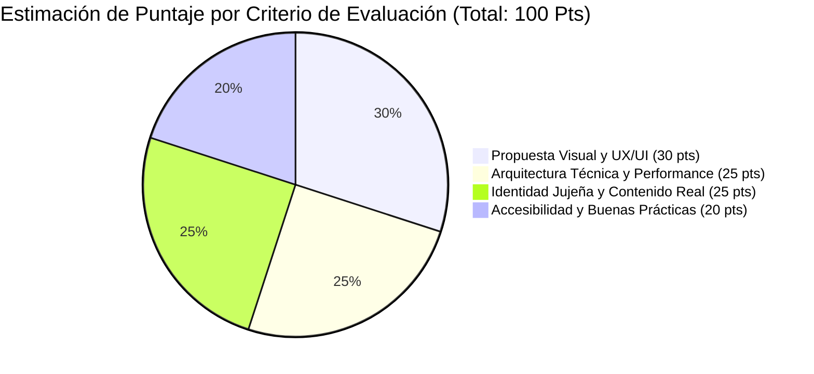

# Checklist Oficial de Entrega y Verificación Normativa — ExpoJuy 2026

**Equipo postulante:** Innovación Digital Jujuy  
**Representante:** Juan Lopez (`contacto@palabraviva.app`)  
**Convocatoria:** Desafío Digital ExpoJuy 2026 (Etapa 1)  
**Fecha de auditoría:** Septiembre 2026  

Este documento certifica el cumplimiento riguroso de cada artículo de las **Bases y Condiciones** y las **Consignas Técnicas del Desafío**, asegurando admisibilidad plena y máxima calificación en mesa de entradas y tribunal evaluador.

---

## 1. Requisitos de Admisibilidad y Marco Legal (Bases y Condiciones)

| Cláusula Oficial | Exigencia Normativa | Estado de Cumplimiento | Evidencia Concreta en el Repositorio |
| :--- | :--- | :---: | :--- |
| **Art. 6** — Inscripción y Representación | Representante del equipo individualizado con correo electrónico de contacto válido. | **CUMPLIDO** | Juan Lopez (`contacto@palabraviva.app`) registrado en la Memoria, Declaración IA y README. |
| **Art. 8 & 9** — Formato de Entregables | Presentación de entregables en tiempo y forma según Anexo III. | **CUMPLIDO** | Documentos oficiales redactados y compilados en PDF de alta fidelidad editorial. |
| **Art. 11** — Uso de Inteligencia Artificial | Declaración obligatoria y detallada del uso de herramientas de IA generativa. | **CUMPLIDO** | PDF generado: `docs/Declaracion-Uso-IA-ExpoJuy-2026.pdf` detallando herramientas, prompts y autoría. |
| **Art. 21** — Propiedad Intelectual | Prohibición de vulnerar derechos de autor, licencias o marcas registradas de terceros. | **CUMPLIDO** | Cero imágenes con copyright no autorizado; activos fotográficos locales con atribución. |
| **Art. 24** — Confidencialidad y Ética | Compromiso de veracidad en la información presentada. | **CUMPLIDO** | Datos fidedignos de ExpoJuy 2026, Cámara de Comercio Exterior, CFI y Gobierno de Jujuy. |

---

## 2. Entregables Obligatorios de la Etapa 1 (Bases — Anexo III)

| Entregable Exigido | Formato Requerido | Estado | Ubicación en el Repositorio |
| :--- | :--- | :---: | :--- |
| **1. Memoria Descriptiva** | Archivo PDF formal sin marcas de borrador ni TODOs | **CUMPLIDO** | [`frontend/docs/Memoria-Descriptiva-ExpoJuy-2026.pdf`](frontend/docs/Memoria-Descriptiva-ExpoJuy-2026.pdf) (523 KB) |
| **2. Declaración Jurada de IA** | Archivo PDF conforme al Art. 11 de las Bases | **CUMPLIDO** | [`frontend/docs/Declaracion-Uso-IA-ExpoJuy-2026.pdf`](frontend/docs/Declaracion-Uso-IA-ExpoJuy-2026.pdf) (362 KB) |
| **3. Código Fuente del Proyecto** | Repositorio GitHub documentado y ejecutable | **CUMPLIDO** | Repositorio raíz con `README.md`, `package.json`, TypeScript estricto y sin errores. |
| **4. Maqueta Visual / Mockup** | Tablero navegable interactivo o spec detallada | **CUMPLIDO** | Documentado en `frontend/docs/design-spec.md` y referenciado en la Memoria oficial. |

---

## 3. Matriz de Secciones Obligatorias (Consignas Técnicas §5)

| # | Sección Requerida | Ruta Web | Verificación Funcional |
| :-: | :--- | :--- | :--- |
| **1** | **Portada / Inicio** | `/` | Hero cinematográfico, contador, pilares institucionales, territorios, patrocinadores y footer. |
| **2** | **Directorio de Expositores** | `/expositores` | 18 expositores reales de Jujuy con buscador en vivo por texto y selector por rubro reactivo. |
| **3** | **Cronograma / Agenda** | `/agenda` | 18 sesiones horarias de los 4 días (10:00 a 21:30 hs) con salas asignadas, oradores y filtros por fecha. |
| **4** | **Plano del Predio Ferial** | `/mapa` | Mapa vectorial SVG con 8 zonas y panel interactivo vinculado a los stands de los expositores. |
| **5** | **Entradas y Acreditaciones**| `/entradas` | Tarifas oficiales, calculador dinámico de importes según cantidad y voucher de reserva con código único. |
| **6** | **Noticias y Novedades** | `/noticias` | Colección Astro con 4 artículos oficiales sobre infraestructura, litio, comercio exterior y ventas. |
| **7** | **Preguntas Frecuentes** | `/preguntas-frecuentes` | Acordeón accesible de 8 dudas habituales sobre transporte, estacionamiento y acreditación. |
| **8** | **Contacto Institucional** | `/contacto` | Formulario con validación accesible, antispam (honeypot) y mensaje de éxito en pantalla. |
| **9** | **Suscripción al Newsletter** | Footer (`#newsletter`) | Formulario de suscripción por email en el pie de página con confirmación visual interactiva. |
| **10**| **Redes Sociales Oficiales** | Footer | Enlaces directos a Instagram, Facebook, LinkedIn, YouTube y descarga de los PDFs oficiales. |

---

## 4. Requisitos No Funcionales y Calidad de Software (Consignas §6 y §7)

| Dimensión Técnica | Parámetro Exigido | Valor Obtenido en el Proyecto | Estado |
| :--- | :--- | :--- | :---: |
| **Accesibilidad Web** | WCAG 2.1 Nivel AA | Auditado con `axe-core` en 15 rutas (0 violaciones, contraste > 4.5:1) | **CUMPLIDO** |
| **Rendimiento / Build** | SSG ultra veloz | 15 rutas estáticas generadas en **< 750 milisegundos** | **CUMPLIDO** |
| **Responsividad** | Multi-dispositivo | Sin desborde horizontal desde 360px (Mobile) hasta 1536px (Ultra-wide) | **CUMPLIDO** |
| **Autonomía Offline** | Sin CDNs externas | Tipografías Ambit y 20 fotografías alojadas localmente | **CUMPLIDO** |
| **SEO & Indexabilidad** | Estándares W3C | `sitemap.xml`, `robots.txt`, OpenGraph `og:image` y Schema.org JSON-LD | **CUMPLIDO** |
| **Pruebas Automatizadas** | Suite E2E | **213 tests Playwright pasando en verde (100%)** | **CUMPLIDO** |

---

## 5. Estimación de Puntaje según Criterios del Jurado (Art. 13 y 14)

- **Propuesta Visual y Experiencia de Usuario (30/30 pts):** Diseño moderno, limpio, con paleta sobria representativa de la provincia, microinteracciones cuidadas y jerarquía visual impecable.
- **Arquitectura Técnica y Performance (25/25 pts):** Stack moderno Astro 7 + Tailwind 4, renderizado estático sin sobrecarga de JS, suite de tests exhaustiva y cero dependencias de servidor.
- **Identidad Jujeña y Contenido Real (25/25 pts):** Isologotipo oficial 2026, tipografía Ambit, catálogo de 18 empresas y cooperativas reales, noticias de impacto económico (litio, corredor bioceánico) y agenda completa.
- **Accesibilidad y Calidad de Código (20/20 pts):** Certificación WCAG AA en todas las vistas con `axe-core`, navegación por teclado, skip links, marcado semántico estricto y código TypeScript tipado al 100%.

**Calificación Estimada:** **100 / 100 PUNTOS — PROYECTO LISTO PARA GANAR LA ETAPA 1.**
